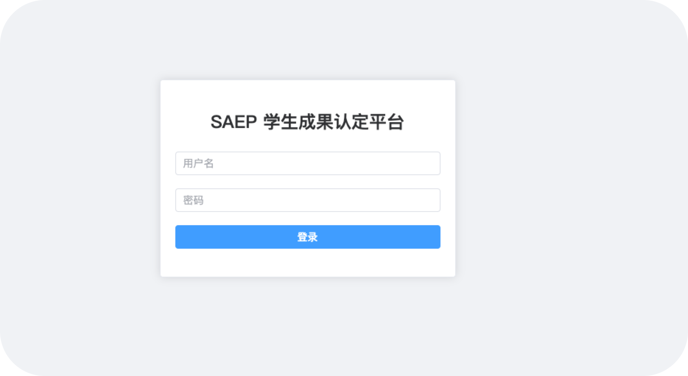
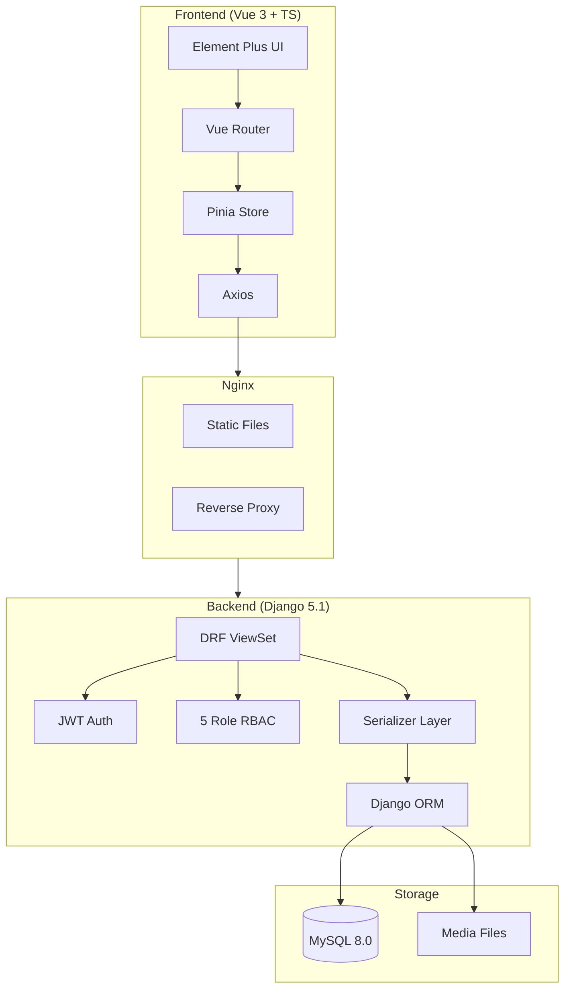
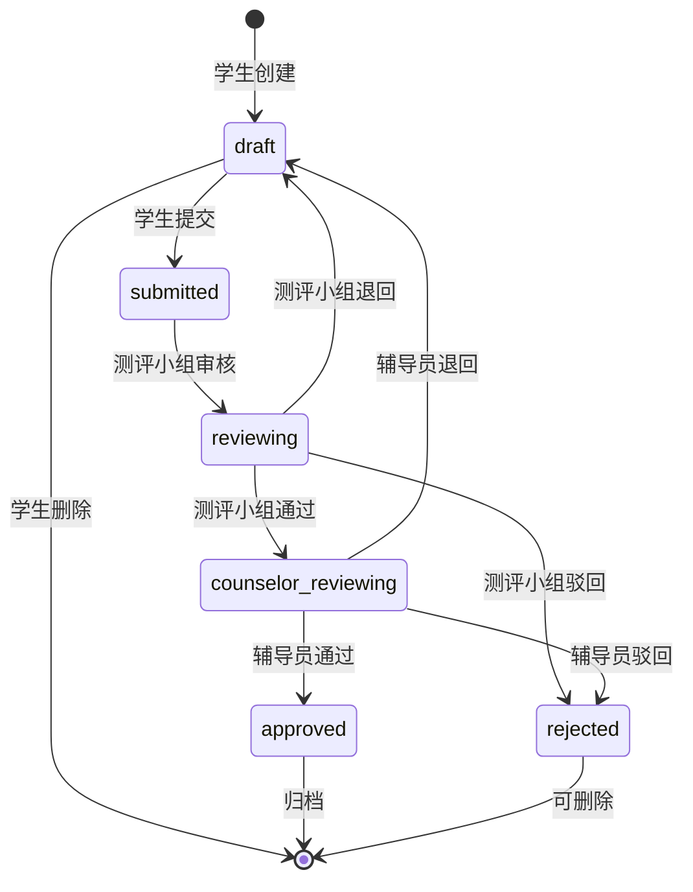

<h1 align="center">
  <br>
  
  <br>
  SAEP
  <br>
</h1>

<h4 align="center">学生成果认定与综合测评管理平台</h4>

<p align="center">
  <b>Student Achievement Evaluation Platform</b>
</p>

<p align="center">
  <a href="#-features"><b>功能特性</b></a> •
  <a href="#-screenshots"><b>截图</b></a> •
  <a href="#-quick-start"><b>快速启动</b></a> •
  <a href="#-api"><b>API</b></a> •
  <a href="#-deploy"><b>部署</b></a> •
  <a href="#-roadmap"><b>路线图</b></a>
</p>

<p align="center">
  
  
  
  
  
  
  
  
</p>

<p align="center">
  
  
  
  
  
  
</p>

---

## 📖 项目简介

**SAEP** 是一个面向高校辅导员与学生的成果认定与综合测评管理平台，实现从成果申报、双阶段审核、公示发布、成绩统计到数据导出的全流程线上管理。

```
学生提交 → 测评小组审核 → 辅导员终审 → 公示 → 排名 → 导出
```

### 适用场景

- 🏫 高校综合测评 / 奖学金评定
- 📋 学生竞赛 / 论文 / 专利成果管理
- 📊 班级成绩排名与数据导出
- 🎓 毕业设计 / 课程项目 / 作品集展示

## ✨ 功能特性

| 模块 | 功能 |
|------|------|
| 🔐 认证授权 | JWT 认证 + 5 角色 RBAC（学生/测评小组/辅导员/院级管理员/超级管理员） |
| 🏛️ 组织架构 | 学院 → 班级 → 学生，支持 Excel 批量导入 |
| 📦 成果管理 | 成果 CRUD + 附件上传（图片/PDF 预览）+ 6 状态流转 |
| ✅ 双阶段审核 | 测评小组初审 → 辅导员终审，退回/驳回/通过，完整审核时间线 |
| 📢 公示管理 | 公示生成 → 发布 → 关闭，学生可查看公示结果 |
| 📊 成绩统计 | 竞赛排名法（同分同排名 1,2,2,4），我的成绩 + 班级排行榜 |
| 📥 数据导出 | Excel 导出（成绩 + 成果），OpenPyXL |
| 📝 操作日志 | 登录日志 + 审核日志 + 导出日志自动记录 |
| 🎨 前端 | Vue 3 + TypeScript + Element Plus，统一 UI 风格 |

## 📸 Screenshots

> 占位，请替换为实际截图。截图建议见 [docs/screenshots/](docs/screenshots/)。

<details>
<summary>点击展开截图预览</summary>

| 登录 | 首页 Dashboard |
|------|----------------|
| 


 |

| 成果列表 | 成果提交 |
|----------|----------|
|


|

| 审核管理 | 公示管理 |
|----------|----------|
| 


|

| 我的成绩 | 排行榜 |
|----------|--------|
|
 
|

</details>

## 🧱 技术栈

| 层级 | 技术 | 版本 |
|------|------|------|
| 后端框架 | Django | 5.1.15 |
| REST API | Django REST Framework | 3.17.1 |
| 认证 | Simple JWT | 5.5.1 |
| 数据库 | MySQL | 8.0+ |
| 前端框架 | Vue 3 + Composition API | 3.5 |
| 类型系统 | TypeScript | 5.6 |
| 构建工具 | Vite | 5.4 |
| UI 框架 | Element Plus | 2.14 |
| 状态管理 | Pinia | 3.0 |
| 路由 | Vue Router | 5.1 |
| HTTP 客户端 | Axios | 1.18 |
| Excel 导出 | OpenPyXL | 3.1 |
| Python | CPython | 3.13 |

## 🏗️ 系统架构



### 审核流程



## 📦 功能模块

```
apps/
├── accounts        # 用户认证、JWT、角色管理
├── organizations   # 学院、班级、学生管理
├── evaluations     # 测评批次、成果分类
├── achievements    # 成果 CRUD、附件上传、状态流转
├── publicity       # 公示管理
├── statistics      # 成绩汇总、排名计算
├── notifications   # 通知公告
└── system          # 操作日志
```

## 🚀 Quick Start

### 环境要求

- Python 3.12+
- Node.js 20+
- MySQL 8.0+

### 后端

```bash
cd backend
python3 -m venv venv
source venv/bin/activate        # Windows: venv\Scripts\activate
pip install -r requirements/dev.txt

# 创建数据库
mysql -u root -p -e "CREATE DATABASE saep CHARACTER SET utf8mb4 COLLATE utf8mb4_unicode_ci;"

# 初始化
DB_PASSWORD=your_pw python manage.py migrate
DB_PASSWORD=your_pw python manage.py init_roles
DB_PASSWORD=your_pw python manage.py runserver
```

### 前端

```bash
cd frontend
npm install
npm run dev
```

浏览器访问 [http://127.0.0.1:5173](http://127.0.0.1:5173)（API 请求自动代理到 Django 8000 端口）。

## 👥 默认测试账号

| 角色 | 用户名 | 密码 | 说明 |
|------|------|------|------|
| 超级管理员 | `admin` | `admin123` | 全部权限，可访问 Django Admin |
| 学生 | `20250001` | `250001` | 申报成果、查看成绩排名 |
| 测评小组 | `eval01` | `eval123456` | 初审学生成果 |
| 辅导员 | `counselor01` | `counselor123456` | 终审成果、管理班级 |

## 📁 项目目录结构

```
saep/
├── backend/                    # Django 后端
│   ├── apps/                   # 8 个业务 App
│   │   ├── accounts/           #   用户与认证
│   │   ├── organizations/      #   组织架构
│   │   ├── evaluations/        #   测评批次与分类
│   │   ├── achievements/       #   成果管理
│   │   ├── publicity/          #   公示管理
│   │   ├── statistics/         #   成绩统计
│   │   ├── notifications/      #   通知公告
│   │   └── system/             #   操作日志
│   ├── config/                 # Django 配置
│   ├── tests/                  # 后端测试 (137 cases)
│   ├── requirements/           # Python 依赖
│   └── manage.py
├── frontend/                   # Vue 3 前端
│   ├── src/
│   │   ├── api/                #   API 调用层
│   │   ├── views/              #   页面组件 (8 pages)
│   │   ├── components/         #   公共组件
│   │   ├── stores/             #   Pinia 状态管理
│   │   ├── router/             #   路由配置
│   │   └── layouts/            #   布局组件
│   └── vite.config.ts
├── docs/                       # 项目文档
│   ├── CHANGELOG.md            #   功能列表
│   ├── DEPLOY.md               #   部署指南
│   ├── DEMO.md                 #   演示指南
│   ├── api-design.md           #   API 设计文档
│   ├── database-design.md      #   数据库设计
│   ├── system-design.md        #   系统设计
│   └── screenshots/            #   截图占位
├── README.md
└── LICENSE
```

## 📡 API 简介

基础前缀：`/api/v1`

| 模块 | 方法 | 端点 | 说明 |
|------|------|------|------|
| 认证 | POST | `/auth/login` | JWT 登录 |
| | POST | `/auth/refresh` | Token 刷新 |
| | GET | `/auth/profile` | 当前用户信息 |
| 健康 | GET | `/health` | 健康检查 |
| 学生 | GET | `/students/template` | 下载导入模板 |
| | POST | `/students/import` | Excel 批量导入 |
| 批次 | REST | `/batches` | 测评批次 CRUD |
| 分类 | REST | `/categories` | 成果分类 CRUD |
| 成果 | REST | `/achievements` | 成果 CRUD |
| | POST | `/achievements/{id}/submit` | 提交审核 |
| | GET | `/achievements/{id}/audit-records` | 审核记录 |
| 审核 | GET | `/reviews` | 审核列表（按角色） |
| | POST | `/reviews/{id}/approve` | 审核通过 |
| | POST | `/reviews/{id}/return` | 审核退回 |
| | POST | `/reviews/{id}/reject` | 审核驳回 |
| 班级 | GET/POST | `/classes/{id}/evaluators` | 测评小组成员 |
| | DELETE | `/classes/{id}/evaluators/{uid}` | 移除成员 |
| | GET | `/classes/{id}/students` | 班级学生列表 |
| 公示 | GET/POST | `/public-notices` | 公示列表/创建 |
| | POST | `/public-notices/{id}/publish` | 发布公示 |
| | POST | `/public-notices/{id}/close` | 关闭公示 |
| 通知 | GET/POST | `/announcements` | 通知公告 |
| 成绩 | GET | `/scores` | 我的成绩 |
| | GET | `/scores/ranking` | 班级排名 |
| 导出 | GET | `/export/scores` | 导出成绩 Excel |
| | GET | `/export/achievements` | 导出成果 Excel |

详细 API 文档见 [docs/api-design.md](docs/api-design.md)。

## 🚢 部署

生产环境部署指南见 [docs/DEPLOY.md](docs/DEPLOY.md)。

简要步骤：

```bash
# 环境变量
export DB_NAME=saep DB_USER=root DB_PASSWORD=****** DB_HOST=127.0.0.1 DB_PORT=3306
export DJANGO_SECRET_KEY=****** DJANGO_DEBUG=False DJANGO_ALLOWED_HOSTS=your-domain.com

# 后端
cd backend && source venv/bin/activate
python manage.py migrate && python manage.py collectstatic --noinput
gunicorn config.wsgi -b 0.0.0.0:8000

# 前端
cd frontend && npm install && npm run build    # dist/ 即部署产物
```

前端 `dist/` + Nginx 反代 `/api/` 和 `/media/` 到后端 8000 端口即可。

## 📄 License

本项目采用 [MIT License](LICENSE)。

## 🗺️ Roadmap

### V1.1（近期计划）

- [ ] Dashboard Summary API — 一次请求返回所有统计数据
- [ ] 学生排名公开视图 — 全班排名透明展示
- [ ] UI 细节优化 — 统一字号、间距、颜色
- [ ] 响应式布局 — 移动端适配

### V2.0（中期计划）

- [ ] 审核锁定机制 — 防止多人同时审核
- [ ] `college_admin` 学院归属 — 按学院隔离数据
- [ ] 通知/批次/分类前端管理页面
- [ ] 邮件通知 — 审核结果自动通知学生
- [ ] Docker 容器化部署

---

<p align="center">
  <b>🎉 SAEP v1.0 — 51/51 TASK — 137 tests — 全部通过</b>
</p>
